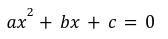
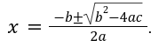

# taller-01: Inputs y Recortes

## Ejercicio 1: Resolver una ecuación cuadrática

Escriba un programa para resolver una ecuación cuadrática. Una ecuación es cuadrática cuando tiene la forma , y donde las soluciones se pueden encontrar utilizando la fórmula:  

Solicite al usuario que ingrese los coeficientes de la ecuación utilizando 3 instrucciones `input()`, luego muestre el resultado de las dos soluciones como se indica en el ejemplo: 

```
Ingrese el coeficiente a: 1
Ingrese el coeficiente b: -11
Ingrese el término independiente c: 24
x1: 3.00
x2: 8.00
```

Las raíces deben mostrarse con dos decimales de precisión.

## Ejercicio 2: Resolver una ecuación cuadrática (b)

Resolver el ejercicio anterior pero cambiar la forma de pedir los datos al usuario con una sola instrucción `input`. De la siguiente manera: 

```
Ingrese los coeficientes a, b, y c de la ecuación separados por espacios: 4 -12 5
x1: -2.50
x2: -0.50
```

En este ejercicio no utilice `.split()` y solo utilice `.find()` y slicing para obtener los coeficientes `a`, `b` y `c` del texto ingresado.
